# qk

`qk` (/kwɪk/) is a slightly more capable command alias tool — built to allow for more a readable and maintainable way of defining aliases, **order-agnostic flags**, and improve reliability with an actual test suite.

Unlike a shell alias or a single rigid regex, qk lets you type declared flags in any order (`qk diff --update --draft D123` and `qk diff --draft --update D123` both work). See [Order-agnostic flags](#order-agnostic-flags).

## History

It all started with a very long glorified if else chain named `qk` in my .bashrc. I wasn't smart enough to remember everything and I didn't like how inflexible just using a command alias was so I started matching commands in the most rudimentary of ways. At first, it was just constant keywords like `git log` but slowly had more and more command line argument handling and eventually reached a breaking point with an AWS S3 command I made to handle copying files with a known prefix. At this point, a lot of people were already using different versions of qk so I just decided, well, let's actually make it useable. And so here we are.

## Install

```bash
make install
source ~/.zshrc   # zsh
source ~/.bashrc  # bash
```

This builds the `qk` binary and adds shell wrappers to `~/.zshrc` and `~/.bashrc` that resolve the command and run it with `eval`.

Other useful targets:

```bash
make build      # run tests and compile
make test       # run tests only
make uninstall  # remove the qk wrappers from ~/.zshrc and ~/.bashrc
make clean      # delete the built binary
```

## Usage

```bash
qk reload
qk git log --all
qk --debug git log --all   # print match details without running
```

In normal mode, it prints the generated command and executes it. In debug mode it only prints the output.

## How it works

Three stages: **define** a `NewCustomCommand` entry, **match** user input against it, **build** and run the resulting shell command.



Source: [`docs/diagrams/how-it-works.mmd`](docs/diagrams/how-it-works.mmd). Regenerate with `make diagrams`.

**Define** — Each entry is a `[]string` of parts plus a callback. `NewCustomCommand` calls `BuildCommandRegex` to produce a top-level `CommandRegex` and per-keyword `FlagRegexes`, stored as a `CustomCommand`. `main.go` loads the standard, user, and work sets at startup.

**Match** — The shell wrapper invokes the binary with your args (joined into one string). `internal.Qk` walks entries in order; `MatchCommand` tests each `CommandRegex` until one matches. `ExtractMatches` then fills a `matches` map — first from keyword suffixes and capture groups, then by scanning for each declared flag independently (this is what makes flag order irrelevant).

**Build** — The matched entry's callback turns `matches` into a shell command string. The binary prints it; the wrapper runs it with `eval` (debug mode prints only).

See [Command definition](#command-definition) and [Matching and extraction](#matching-and-extraction) for regex and flag parsing detail.

## Command definition

A command is declared with `NewCustomCommand`:

```go
*constructors.NewCustomCommand(
    []string{"git", "log"},
    func(command []string, matches map[string]string) string {
        return utils.AutoBuildCommandString(command, matches) +
            "--graph --abbrev-commit --decorate ..."
    },
)
```

Each token in the slice is categorized automatically:


| Token shape        | Category      | Role                                                                     |
| -------------------- | --------------- | -------------------------------------------------------------------------- |
| `git`, `log`, `cp` | keyword       | Matched literally; captures everything after it in the input             |
| `--bulk`, `-a`     | flag          | Parsed separately after match —**not** fixed-order in the command regex |
| `(?P<source>\S+)`  | capture group | Inserted directly into the command regex                                 |



Source: [`docs/diagrams/command-definition.mmd`](docs/diagrams/command-definition.mmd).

Flags are associated with the **most recent keyword** before them in the definition. In the example above, `--bulk` is linked to `cp`.

Go regex capture names cannot contain `-`, so flag groups use underscores internally (`__bulk`) and are converted back to `--bulk` during extraction via `restoreFlagDashes`.

## Matching and extraction

When you run `qk`, arguments are joined into a single string and checked against each registered command in order.



Source: [`docs/diagrams/matching-extraction.mmd`](docs/diagrams/matching-extraction.mmd).

Matching happens in two passes. Pass 1 decides *which* `NewCustomCommand` entry matched; pass 2 is what makes **flag order irrelevant**.

### Pass 1: command regex

`MatchCommand` runs the entry's `CommandRegex` against the full input string. That regex is built from **keywords and capture groups only** — declared flags are deliberately left out (`buildCommandRegex` skips flag tokens).

What pass 1 captures:

- **Keyword suffixes** — everything after each keyword, including any flags the user typed (`matches["cp"]`, `matches["git"]`, etc.)
- **Named capture groups** — explicit groups like `source` and `destination`

At this point flags are still embedded inside keyword suffixes. Pass 1 does not care what order they appear in.

### Pass 2: flag regexes

For each keyword that has declared flags, `buildFlagRegexes` has registered a **separate regex per flag**. `ExtractMatches` runs each one against that keyword's suffix independently:

1. Search the suffix for one flag (e.g. `--draft`) anywhere in the remaining text
2. Add it to `matches` under its flag name (e.g. `matches["--draft"]`)
3. Remove the matched flag text from the suffix and move on to the next flag regex

Because each flag is found on its own, the user can reorder them freely. The definition lists which flags exist and which keyword they belong to — not the order the user must type them in.

### Order-agnostic flags

This is the core reason qk handles flags differently from a plain alias or one big regex.

**What a naive approach does:** encode flags in fixed order inside the match pattern, e.g. `git log --all` only matches when `--all` comes immediately after `log`. Reorder the flags and the match fails.

**What qk does instead:**

1. **Define** — `BuildCommandRegex` builds `CommandRegex` without flags, and `buildFlagRegexes` attaches one regex per declared flag to the preceding keyword.
2. **Match (pass 1)** — `CommandRegex` matches the skeleton of the command (keywords + positional captures). Flags in the input are absorbed into keyword suffix text but do not affect whether the entry matches.
3. **Match (pass 2)** — each flag regex scans the suffix for its flag by name. `--draft` and `--update` are looked up independently, so either order works.
4. **Build** — your callback reads `matches["--draft"]`, `matches["--update"]`, etc., and decides what shell command to run.

Example entry:

```go
[]string{"diff", "--draft", "--update", `(?P<args>D\d+)`}
```

Both of these match the same way:

```bash
qk diff --draft --update D123
qk diff --update --draft D123
```

Optional flags still work: if the user omits `--draft`, `matches["--draft"]` is empty and your callback can branch on that.

**Limits worth knowing:**

- Flag order is free **within the suffix of the keyword they belong to** — flags attach to the most recent keyword in the definition, not globally across the whole command
- Capture groups in the command regex are still positional relative to the overall pattern
- Undeclared flags the user adds stay on the keyword suffix (handled by `AutoBuildCommandString`, not by `FlagRegexes`)

## Callback helpers

Common helpers in `internal/utils`:

- **`AutoBuildCommandString(command, matches)`** — replays what the user typed for each keyword (`git` + ` log --all` → `git log --all`), then you can append fixed flags
- **`BuildCommandString(command)`** — joins definition parts with spaces only; ignores user input
- **`BuildMultilineCommandString(commands)`** — joins multiple shell lines with newlines

## Adding a command

1. Add a `NewCustomCommand` entry in `commands/standard`, `commands/user`, or `commands/work`
2. Write a callback that builds the shell command from `matches`
3. Add a test in the same package
4. Run `make build`

### Simple command

No arguments — just match a keyword and return a fixed shell command:

```go
*constructors.NewCustomCommand(
    []string{"reload"},
    func(command []string, matches map[string]string) string {
        return "source ~/.zshrc"
    },
),
```

### Capture groups

Use a raw regex capture group for positional arguments. The group name becomes a key in `matches`:

```go
*constructors.NewCustomCommand(
    []string{"git", "pullout", "(?P<branch_name>.+)"},
    func(command []string, matches map[string]string) string {
        return "git pull && git checkout -b " + matches["branch_name"]
    },
),
```

Running `qk git pullout my-feature` sets `matches["branch_name"]` to `"my-feature"`.

### Flags

Declared flags are **order-agnostic**: the user can type them in any order after the keyword they belong to. That works because flags are excluded from `CommandRegex` and matched one at a time in pass 2 — see [Order-agnostic flags](#order-agnostic-flags).

Flags are tokens in the definition that start with `-` or `--`, placed **after the keyword they belong to**:

```go
[]string{"aws", "s3", "cp", "--bulk", "(?P<source>\\S+)", "(?P<destination>\\S+)"}
//                          ^^^^^^^^
//                          flag attached to keyword "cp"
```

**How flags end up in `matches`**

For input `qk aws s3 cp --bulk s3://bucket/path dest`:


| Key           | Value                      | Source                                   |
| --------------- | ---------------------------- | ------------------------------------------ |
| `cp`          | `" s3://bucket/path dest"` | keyword suffix after`--bulk` is stripped |
| `--bulk`      | `"--bulk"`                 | flag parsed from`cp` suffix              |
| `source`      | `"s3://bucket/path"`       | capture group                            |
| `destination` | `"dest"`                   | capture group                            |

In your callback, read flags by their literal name:

```go
if matches["--bulk"] != "" {
    // user passed --bulk
}
```

**Multiple flags on one keyword**

List each flag after the keyword. The definition order only controls how `buildFlagRegexes` registers them — not the order the user must type:

```go
*constructors.NewCustomCommand(
    []string{"diff", "--draft", "--update", `(?P<args>D\d+)`},
    func(command []string, matches map[string]string) string {
        if matches["--draft"] != "" {
            return utils.BuildCommandString([]string{
                "arc", "diff", "--skip-staging", matches["diff"], matches["--draft"], matches["args"],
            })
        }
        return utils.BuildCommandString([]string{
            "arc", "diff", "--only", "--skip-staging", matches["diff"], matches["--update"], matches["args"],
        })
    },
),
```

Both `qk diff --draft --update D123` and `qk diff --update --draft D123` can match; use empty-string checks for optional flags.

**Flags with user-typed arguments**

When the user passes extra flags that are not declared in the definition, they remain on the keyword suffix. `AutoBuildCommandString` replays them:

```go
*constructors.NewCustomCommand(
    []string{"git", "log"},
    func(command []string, matches map[string]string) string {
        return utils.AutoBuildCommandString(command, matches) +
            "--graph --abbrev-commit --decorate ..."
    },
),
```

`qk git log --all` → `AutoBuildCommandString` produces `git log --all`, then the callback appends the fixed `--graph ...` flags.

**Flag rules**

- A flag applies to the **most recent keyword** before it in the definition
- Flag keys in `matches` use the flag text itself (`"-b"`, `"--bulk"`, `"--draft"`)
- If the user omits a flag, its `matches` entry is an empty string — check before using it
- Go regex capture names cannot contain `-`; qk handles this internally when parsing flags

### Testing

Add a test alongside the command that asserts the generated shell string:

```go
func TestGitPullout(t *testing.T) {
    commandString := internal.Qk(
        []string{"git", "pullout", "my-feature"},
        GetStandardCommands(),
        new(bool),
    )
    utils.AssertEqual(t, "git pull && git checkout -b my-feature", commandString)
}
```

Use `qk --debug ...` while developing to inspect regex matching and the extracted `matches` map.

## Project layout

```
qk/
├── main.go                 # CLI entrypoint, loads command sets
├── commands/
│   ├── standard/           # shared commands
│   ├── user/               # personal commands
│   └── work/               # local/work commands (gitignored)
|                           # use your own /work repository
|                           # to minimize sharing sensitive company details
├── internal/
│   ├── qk.go               # main matching loop
│   ├── functions/          # regex builders and matchers
│   ├── types/              # CustomCommand type and constructor
│   └── utils/              # string builders and test helpers
├── docs/diagrams/          # Mermaid sources (.mmd) and rendered SVGs for README
├── install/
│   ├── qk.zsh              # zsh wrapper installed into ~/.zshrc
│   └── qk.bash             # bash wrapper installed into ~/.bashrc
├── package.json            # local @mermaid-js/mermaid-cli for diagram rendering
└── Makefile
```

### Diagrams

README diagrams are pre-rendered SVGs in `docs/diagrams/`. To edit them, change the `.mmd` source files and regenerate:

```bash
npm install      # installs local mermaid-cli and headless Chrome for puppeteer
make diagrams    # or: npm run diagrams
```

## Debug mode

Pass `--debug` to print the regex being checked, extracted matches, and the generated command without executing (when using the zsh wrapper, debug output is printed but not eval'd).

```bash
qk --debug aws s3 cp --bulk s3://bucket/path dest
```
